# Yoga

> 我们都说身体是革命的本钱。程序员这个职位，大量时间需坐电脑旁，锻炼身体更是必要、必须。身体棒，神清气爽，工作效率当然会倍棒，学习起来也往往事半功倍。

> 那么我们应该怎么来锻炼身体呢？一般来说，跑步、郊游、游泳、打球`瑜伽`等是常见的方式。而瑜伽作为一门`神奇`的锻炼方式，越来越招更多人的喜爱。笔者与瑜伽结缘始于2016年当时公司组织的每周三晚上的瑜伽活动。每次用心练过瑜伽之后，第二天都会有明显变化。精气神明显提示，浑身上下充满了力量。

> 在此很有必要分享一下瑜伽的常用经典招式。

## 猫式
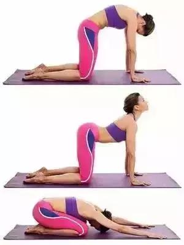
1. 桌子姿势准备，保持呼吸五次，一呼一吸为一次。

2. 呼气时，低头弓背，两胸之间尽可能拱起来，下巴尽可能靠近锁骨，保持呼吸五次。

3. 吸气时，抬头推胸向上，腰部微微向下，尾骨内收，注意不要耸肩，保持呼吸五次。

4. 重复2-3步。
> 益处：按摩腹部内脏, 缓解脊柱的僵硬

## 虎式
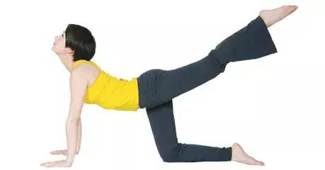
1. 桌子姿势准备，保持呼吸五次，一呼一吸为一次。

2. 吸气，左腿向后向上抬起，眼睛向上看，保持呼气五次，一呼一吸为一次。

3. 吸气，右腿向左向上抬起，眼睛向上看，保持呼气五次，一呼一吸为一次。

4. 重复2-3步。

> 减少髋部和大腿的脂肪，伸展脊柱，强壮脊柱神经和坐骨神经。

## 犁式
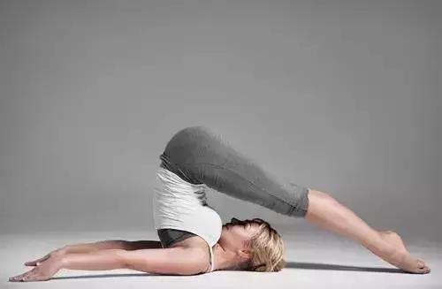
1. 双腿上举90度，双手扶在后腰处。

2. 缓慢地将背部立起，双腿朝地面方向下落，脚尖点地，头、肩保持不动，下巴内收，双腿自然伸直，双手掌心向下，按压地面。

3. 维持身体平衡，保持呼吸五次。重复上述动作。

> 缓解下半身的紧张和压力。
## 花环式
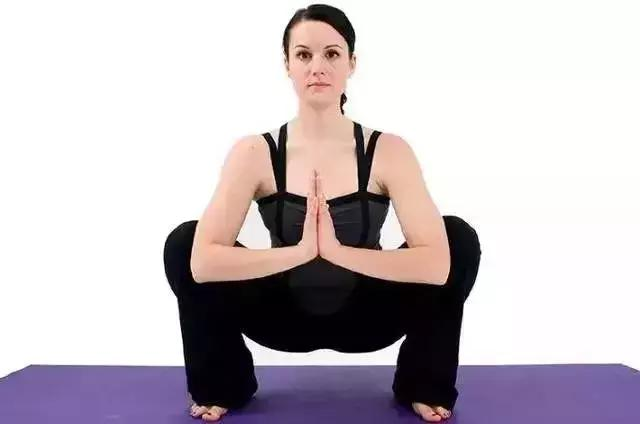
1. 蹲坐，两脚平放于地面上，上体直立，分开两膝。

2. 上身躯干向前倾，头向后仰，把两腋窝展开盖住两膝内侧，双手去抓脚踝后方，把头垂下放在地上。

3. 保持上述动作5个呼吸。之后两手放开脚踝，还原休息，重复上述动作。

此体式可以使得背部、和脖子的肌肉得到很好的拉伸，帮助腹部器官回位。

## 束脚式
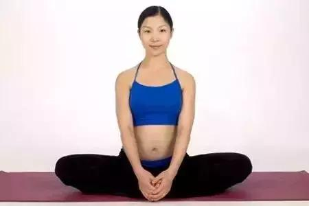
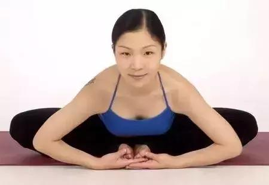
> 通过打开髋部和腹股沟，按摩小腹器官，可以调整不规则经期，促进卵巢功能正常。对于男性而言可以则是使得肾脏、前列腺和膀胱得到滋养，保持生殖系统健康。

## 脊柱扭转式
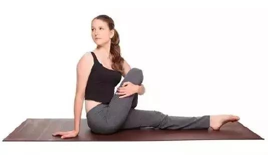
> 强健胸部肩膀的肌肉，保健胸部，排除肺部毒素。同时轻柔按摩腹部器官，纠正因平时姿态不正而引起的腹部胀痛。
## 倒立体式
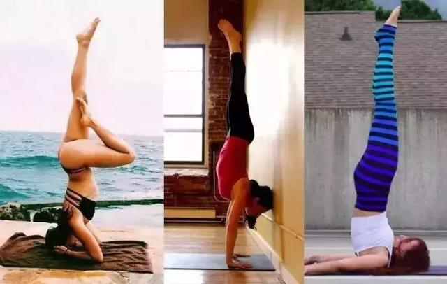
> 倒立，让每天经受重力的内脏有了重新调整、梳理的机会，益处大大。

## 下犬式
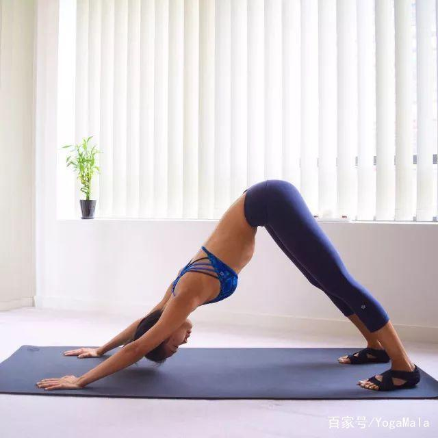

> 下犬式练习牵动全身，做好了下犬式，即是锻炼了全身肌肉，还可以增强双腿、双臂的力量，给躯干创造出空间，缓解肩胛骨区域的僵硬，促进内脏器官更好运行。

## 小燕飞
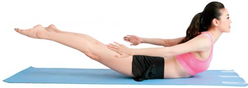
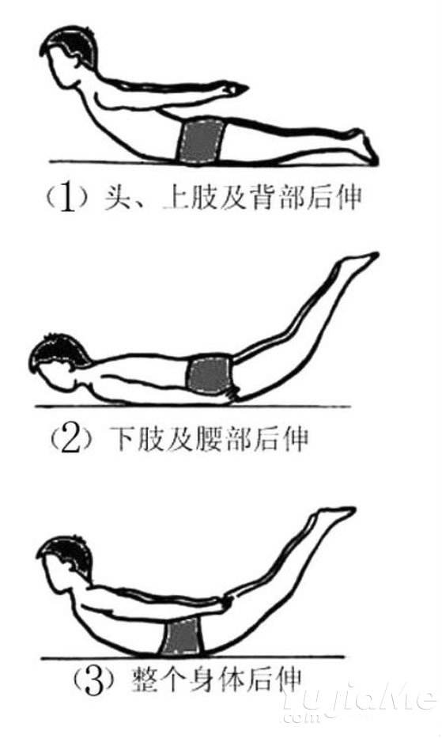
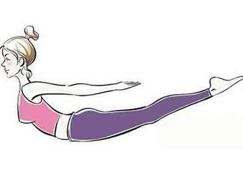
> 模拟燕子飞行姿势，可以充分锻炼腰背部的肌肉和韧带，保护椎间盘使之不突出。